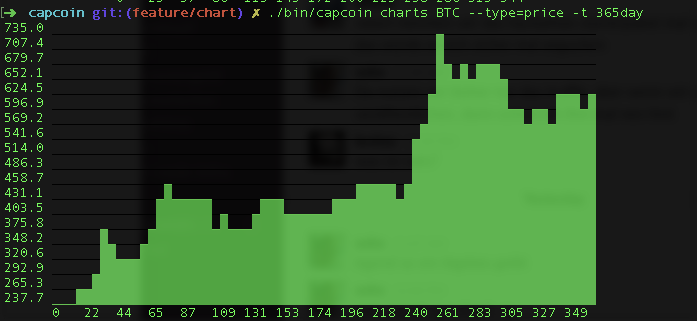

# capcoin - A cli interface for coincap

[](https://badge.fury.io/js/capcoin) [](https://travis-ci.org/sebs/capcoin) [](https://codeclimate.com/github/sebs/capcoin)

* Outputs JSON
* supports the full GET API
* sockets: upcoming




## Usage

* capcoin coins - Supported coins
* capcoin map - object of Coin symbols/names and known aliases
* capcoin front - frontpage data
* capcoin global - global data
* capcoin page - detail data
* capcoin history - history data
* capcoin charts - history data
* capcoin live - live trades and global data


```bash
capcoin history -t 90day XXX --json
90day
{"market_cap":[],"price":[],"volume":[]}
```

## Install

```bash
npm install capcoin -g
```
